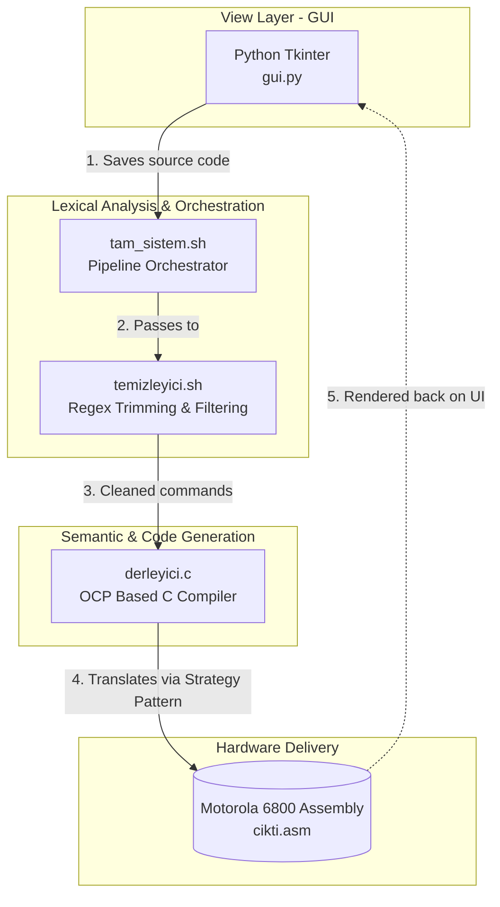

[](https://github.com/goktugcakiroglu/TinySys/actions/workflows/tinysys-ci.yml)

TinySys, üst seviye bir dil olan TinyLang ile yazılan kodları Motorola 6800 Assembly makine koduna çeviren, modüler bir derleyici projesidir. Proje, yazılım mimarisinde katmanlı yapı prensiplerini uygulamak amacıyla; bir Python arayüzü, Bash tabanlı ön işleme (pre-processing) betikleri ve C dili ile geliştirilmiş bir derleyici çekirdeğinden oluşmaktadır.

**Current Status:** Includes Semantic Analysis & Symbol Table for variable tracking.

## 🏗️ Compiler Pipeline Architecture

Derleme süreci, 3 farklı dilin ve katmanın birbirine entegre çalıştığı bir boru hattıdır (Pipeline):



**Pass 1 — Lexical Pre-processing (Bash/Linux):** Kullanıcının GUI'den girdiği ham TinyLang kodu geçici bir dosyaya kaydedilir. temizleyici.sh betiği; boşlukları ve yorum satırlarını (//) tıraşlar, saf komutları bırakır.

**Pass 2 — Strategy-Based Compilation (C Backend):** Temizlenen kod derleyici.c motoruna beslenir. Motor, if-else bloklarına boğulmak yerine SOLID/OCP (Open-Closed Principle) kurallarına göre tasarlanmış rules[] dizisini (Fonksiyon Göstericileri) kullanarak komutları analiz eder (Semantic Analysis).

**Pass 3 — Hardware Delivery (SDK6800 Strict Compliance):** Emülatörün çökmesini engellemek için kodlar hizalanır ve IF/WHILE etiketlerinin yanına mecburi derleyici boşlukları otomatik olarak eklenir.

## Requirements

Projeyi derlemek ve çalıştırmak için aşağıdaki Linux/WSL ortamı gereksinimlerine ihtiyaç vardır:
* **Operating System:** Linux / Ubuntu (WSL uyumlu)
* **Compiler:** GCC (C motorunu derlemek için)
* **Frontend Environment:** Python 3.x ve `tkinter` kütüphanesi
* **Target Hardware:** SDK6800 / 6811 Emulator (Çıktıyı simüle etmek için)

## Build & Run

1. Proje dizinine gidin:
```bash
git clone [https://github.com/goktugcakiroglu/TinySys.git](https://github.com/goktugcakiroglu/TinySys.git)
cd TinySys
```
2. İşletim sistemi betiklerine (Bash) çalıştırma izni verin:
```bash
chmod +x temizleyici.sh tam_sistem.sh
```
3. C derleyici motorunu sisteme tanıtın (Eğer henüz derlenmediyse):
```bash
gcc derleyici.c -o derleyici
```
4. Grafiksel Kullanıcı Arayüzünü (GUI) başlatın:
```bash
python3 gui.py
```

## How It Works (The Pipeline)

Derleme süreci, 3 farklı dilin ve katmanın birbirine entegre çalıştığı bir boru hattıdır (Pipeline):

1. **Pass 1 — Lexical Pre-processing (Bash/Linux):** Kullanıcının GUI'den girdiği ham TinyLang kodu geçici bir dosyaya kaydedilir. `temizleyici.sh` betiği; `sed`, `awk` ve `grep` kullanarak boşlukları, yorum satırlarını (`//`) tıraşlar ve sadece saf komutları bırakır.
2. **Pass 2 — Strategy-Based Compilation (C Backend):** Temizlenen kod `derleyici.c` motoruna beslenir. Motor, if-else bloklarına boğulmak yerine **SOLID/OCP (Open-Closed Principle)** kurallarına göre tasarlanmış `rules[]` (Fonksiyon Göstericileri) dizisini kullanarak satırları analiz eder ve donanım diline çevirir.
3. **Pass 3 — Hardware Delivery (SDK6800 Strict Compliance):** Üretilen Assembly kodu rastgele oluşturulmaz. Emülatörün çökmesini engellemek için kodlar; `0001` gibi satır numaralarından arındırılır, komutlar temiz bir tab (sekme) boşluğuyla hizalanır ve `IF/WHILE` etiketlerinin yanına mecburi derleyici boşlukları otomatik olarak eklenir.

## Supported Language Features

TinySys C Motoru, aşağıdaki yüksek seviye komutları saf Assembly donanım mantığına çevirebilmektedir:

| Feature | TinyLang Syntax | 6800 Assembly Translation (Opcodes) |
| :--- | :--- | :--- |
| **I/O (Input)** | `READ LIMIT` | `JSR READ`, `STAA LIMIT` |
| **Assignments** | `X = 10` | Immediate Addr: `LDAA #10`, `STAA X` |
| **Arithmetic** | `FARK = X - Y` | `LDAA X`, `SUBA Y`, `STAA FARK` |
| **Bitwise Logic**| `SONUC = FARK & MASK` | `LDAA FARK`, `ANDA MASK`, `STAA SONUC` |
| **Pointers / Arrays**| `POINTER P = &SAYAC`<br>`*P = 15`| Index Register (XR): `LDX #SAYAC`<br>Indexed Addr: `LDAA #15`, `STAA 0,X` |
| **Control Flow (IF)** | `IF SAYAC == 15`<br>`ENDIF` | Condition Code Check: `CMPA #15`, `BNE` (Branch if Not Equal) |
| **Loops (WHILE)**| `WHILE SAYAC < LIMIT`<br>`ENDWHILE` | `CMPA LIMIT`, `BGE` (Exit loop), `BRA` (Return to start) |
| **I/O (Output)** | `PRINT SAYAC` | `LDAA SAYAC`, `JSR PRINT` |

## Error Handling Strategy

Sistem, Python GUI üzerinden arka plan (terminal) hatalarını yakalayan güvenli bir hata yönetim mekanizmasına sahiptir.

| Error Type | Trigger Condition | Output Example |
| :--- | :--- | :--- |
| **Lexical / Pre-processing** | Bash script izinlerinin olmaması veya eksik dosya. | GUI Alert: `Sistem Hatası: bash: ./tam_sistem.sh: Permission denied` |
| **Syntax / Translation** | C motoruna tanımlanmamış (OCP dışı) komut girilmesi. | Assembly Output: `; HATA: Taninmayan TinyLang Komutu -> BİLİNMEYEN X` |
| **Encoding** | Çapraz platformlarda (Windows/WSL) utf-8 satır sonu çatışması. | GUI, `errors="replace"` ile çökmeyi engeller ve raporlar. |

## Project Structure

```text
TinySys/
├── .github/workflows/
│   └── tinysys-ci.yml    # Tam sistem entegrasyon testleri
├── gui.py              # Frontend: Python Tkinter arayüzü ve state yönetimi
├── tam_sistem.sh       # Middleware: Sistem orkestratörü ve Python-C köprüsü
├── temizleyici.sh      # Middleware: Lexical temizleyici (Yorum ve boşluk silici)
├── derleyici.c         # Backend: OCP Mimari ile yazılmış C Compiler motoru
├── test_kodu.txt       # GUI'nin ürettiği, son oturumun hafızada tutulan kaynak kodu
└── cikti.asm           # Çıktı: SDK6800 IDE'sine kopyalanmaya hazır nihai makine kodu
```
